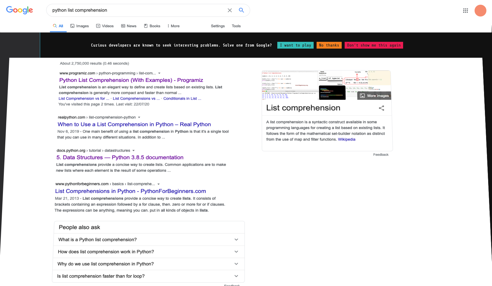

# Google Foobar
These are my solutions to the Google Foobar challenge, done first in Haskell and then in Python.

This repo's purpose is to share my thought process on these challenges for posterity and education.

This repo consists of two projects: a Stack-based Haskell project,
and a PyCharm Python project.

## ⚠️ WARNING: YOU VIEW THESE SOLUTIONS AT YOUR PERIL ⚠️
### THIS REPOSITORY IS *NOT* HERE FOR YOU TO CHEAT.


## What is Google Foobar?
Google Foobar is a not-so-secret, invitation-only series of timed programming challenges by Google, located at https://foobar.withgoogle.com. You can discover an invitation to Google Foobar by Googling certain programming-related topics, by snooping through the Google doodles, or by receiving an invitation from someone. After enough time (and a little algorithmic luck), Google will present you with Google Foobar with a cool animation on a search page. Google sometimes offers interviews to and hires people who complete Google Foobar.



Google Foobar consists of 5 levels. Each level has a number of problems:
* Level 1 has 1 problem
* Level 2 has 2 problems
* Level 3 has 3 problems
* Level 4 has 2 problems
* Level 5 has 1 problem

The problems primarily involve data structures and algorithms, much like what you would find on Project Euler, LeetCode, or in a technical interview -- Google isn't going to, for instance, ask you in one problem to build a GUI or make a program in Assembly that prints a triangle of asterisks.

You have the option of implementing your solutions in either Java 8 or Python 2. Either way, you submit your solution directly in the browser in a vim-like editor, and then Google runs your solution against a set of tests, most of which are hidden. You must pass *all* of the tests in order to complete the problem. That being said, *avoid a O(n^2) solution at all costs.* At least one of those tests will time out if your solution is inefficient, but Google Foobar won't tell you *why* your test is failing.  

Each problem involves a lot of flavour text: it's your job to determine which details matter. Pay close attention to patterns in the problems.

It is even possible to hack on Google Foobar...

Since you are limited to Java 8 and Python 2 (both of which are very old!), I recommend you try implementing your solution first in a newer version of Java or Python and then translating it down to Java 8 or Python 2. 

I *highly* recommend you implement your solutions in Python because Python needs much less boilerplate than Java - your attention should be squarely on the algorithms, not on navigating an OOP hierarchy. Python's few higher-order functions and easy-to-make lambdas also lend the language well to these kinds of problems - you can implement your solution quickly with higher-level, declarative, FP-like facilities, saving you precious time.

With all that said, I wish you the best of luck on your journey with Google Foobar!
May the lambdas be ever in your favour.

For more information, please see:
https://medium.com/chingu/my-experience-with-the-google-foobar-challenge-and-tips-on-what-to-do-if-you-get-it-9848d31d3d20
https://medium.com/plutonic-services/things-you-should-know-about-google-foobar-invitation-703a535bf30f
https://www.quora.com/What-is-Google-Foobar-1

## How Did I Find Google Foobar?
I first heard about it on a Discord server. Then, I Googled for information about the challenge; I read the articles I linked above, and I watched a few YouTube videos about it.

I'm surprised Google hasn't invited me earlier! My Google search history is full of stuff like "cppreference std vector", "cppreference concepts", "mdn javascript array", "lodash", "rust traits", "haskell maybe", "functors, applicatives, and monads", "graphql typescript", and so on!

Turns out the secret for me was to Google "python list comprehension". With that, I got the Google Foobar invitation right away.

Beats me why a beginner topic like that would do the trick instead of something more advanced and specialized, like "graphql typescript", but whatever...

Now I get the Google Foobar animation *every time* I Google "python list comprehension"!
It's become kind of annoying when I am trying to refresh my memory on list comprehensions in Python because the animation distorts the list of results!

## My Approach
In general, for these challenges, I wrote the initial implementation in Haskell and then translated that over to Python 3, and then adjusted it for Python 2, which is what Google Foobar accepts. I intend for the Haskell implementation to serve as a specification for the behaviour of the Python 2/3 programs.

This is very intentional: I have been knee-deep in functional programming land lately, and I have been having tons of fun working through the Project Euler problems in Haskell. I have found it to be easier to think about and work through algorithm problems in Haskell because the higher-order functions in Haskell allow me to abstract away a lot of boilerplate.

Even though Python is hostile to functional programming, I have found the functions in `itertools` to be sufficient. I have also liberally used `@functools.lru_cache()` to speed up the recursive Python functions in an effort to imitate the memoization GHC does for similar functions.

I have also included basic tests in the Python 3 programs. The `main` function simply runs these tests since Google Foobar doesn't use the `main` function in the Python 2 program.

Please note: I have not included the final Python 2 solutions because they are just trimmed-down versions of the Python 3 solutions.

## Build Instructions
### Haskell
0. Install Stack for your system. Stack will take care of the dependencies for this project, including downloading GHC.
1. Clone or download this repository.
2. `cd` into the `GoogleFoobarHS` directory.
3. Run `stack build`.
4. Run `stack ghci`. This will start a Haskell REPL in this project.
5. Run `<PROBLEM>.solution`, where <PROBLEM> is the problem you want to run, e.g., run `SolarDoomsday.solution` to run the solution for the Solar Doomsday problem.
6. (If you've never used GHCi before) Enter `:quit` when you want to quit the REPL.

### Python 3
If you have Python 3 installed, the choice is yours here:
you can hook the project up to PyCharm, or you can run the individual files on the command line.

There are no external dependencies.
Each problem has its own folder, and each folder has its own `main.py`.

## Challenges
### Level 1
----
#### Solar Doomsday
**Completed: 1 June 2020**
Prompt:
```
Solar Doomsday
==============

Who would've guessed? Doomsday devices take a LOT of power. Commander Lambda wants to supplement the LAMBCHOP's quantum antimatter reactor core with solar arrays, and she's tasked you with setting up the solar panels.

Due to the nature of the space station's outer paneling, all of its solar panels must be squares. Fortunately, you have one very large and flat area of solar material, a pair of industrial-strength scissors, and enough MegaCorp Solar Tape(TM) to piece together any excess panel material into more squares. For example, if you had a total area of 12 square yards of solar material, you would be able to make one 3x3 square panel (with a total area of 9). That would leave 3 square yards, so you can turn those into three 1x1 square solar panels.

Write a function solution(area) that takes as its input a single unit of measure representing the total area of solar panels you have (between 1 and 1000000 inclusive) and returns a list of the areas of the largest squares you could make out of those panels, starting with the largest squares first. So, following the example above, answer(12) would return [9, 1, 1, 1].

Languages
=========

To provide a Python solution, edit solution.py
To provide a Java solution, edit solution.java

Test cases
==========

Inputs:
    (int) area = 12
Output:
    (int list) [9, 1, 1, 1]

Inputs:
    (int) area = 15324
Output:
    (int list) [15129, 169, 25, 1]

Use verify [file] to test your solution and see how it does. When you are finished editing your code, use submit [file] to submit your answer. If your solution passes the test cases, it will be removed from your home folder.
```

### Level 2
----
#### Lovely Lucky LAMBs
**Completed: 3 June 2020**
Prompt:
```
Lovely Lucky LAMBs
==============

Being a henchman isn't all drudgery. Occasionally, when Commander Lambda is feeling generous, she'll hand out Lucky LAMBs (Lambda's All-purpose Money Bucks). Henchmen can use Lucky LAMBs to buy things like a second pair of socks, a pillow for their bunks, or even a third daily meal!

However, actually passing out LAMBs isn't easy. Each henchman squad has a strict seniority ranking which must be respected - or else the henchmen will revolt and you'll all get demoted back to minions again!

There are 4 key rules which you must follow in order to avoid a revolt: 1. The most junior henchman (with the least seniority) gets exactly 1 LAMB. (There will always be at least 1 henchman on a team.) 2. A henchman will revolt if the person who ranks immediately above them gets more than double the number of LAMBs they do. 3. A henchman will revolt if the amount of LAMBs given to their next two subordinates combined is more than the number of LAMBs they get. (Note that the two most junior henchmen won't have two subordinates, so this rule doesn't apply to them. The 2nd most junior henchman would require at least as many LAMBs as the most junior henchman.) 4. You can always find more henchmen to pay - the Commander has plenty of employees. If there are enough LAMBs left over such that another henchman could be added as the most senior while obeying the other rules, you must always add and pay that henchman.

Note that you may not be able to hand out all the LAMBs. A single LAMB cannot be subdivided. That is, all henchmen must get a positive integer number of LAMBs.

Write a function called solution(total_lambs), where total_lambs is the integer number of LAMBs in the handout you are trying to divide. It should return an integer which represents the difference between the minimum and maximum number of henchmen who can share the LAMBs (that is, being as generous as possible to those you pay and as stingy as possible, respectively) while still obeying all of the above rules to avoid a revolt. For instance, if you had 10 LAMBs and were as generous as possible, you could only pay 3 henchmen (1, 2, and 4 LAMBs, in order of ascending seniority), whereas if you were as stingy as possible, you could pay 4 henchmen (1, 1, 2, and 3 LAMBs). Therefore, solution(10) should return 4-3 = 1.

To keep things interesting, Commander Lambda varies the sizes of the Lucky LAMB payouts: you can expect total_lambs to always be between 10 and 1 billion (10 ^ 9).

Languages
=========

To provide a Python solution, edit solution.py
To provide a Java solution, edit solution.java

Test cases
==========

Inputs:
    (int) total_lambs = 10
Output:
    (int) 1

Inputs:
    (int) total_lambs = 143
Output:
    (int) 3

Use verify [file] to test your solution and see how it does. When you are finished editing your code, use submit [file] to submit your answer. If your solution passes the test cases, it will be removed from your home folder.
```

### Level 3
----


### Level 4
----


### Level 5
----

## ⚠️ WARNING: YOU VIEW THESE SOLUTIONS AT YOUR PERIL ⚠️
### THIS REPOSITORY IS *NOT* HERE FOR YOU TO CHEAT.
